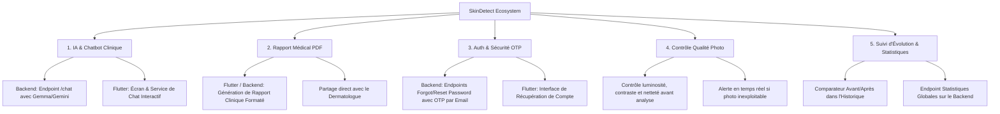

# Plan d'Implémentation Global — SkinDetect (Backend FastAPI & Flutter)

Ce plan détaille la mise en œuvre de la suite complète d'améliorations et de fonctionnalités pour la plateforme **SkinDetect**, couvrant l'intelligence artificielle, la sécurité, l'expérience utilisateur et les outils cliniques.

---

## 🎯 Périmètre des Fonctionnalités à Implémenter

---

## 🛠️ Modifications Proposées

### 1. Backend FastAPI

#### [MODIFY] [db_models.py](file:///d:/project/detectionbackend/db_models.py)
- Ajouter une table `PasswordResetToken` (user_id, code_otp, expires_at, used).
- Ajouter un champ de métadonnées de suivi/notes sur `Prediction`.

#### [MODIFY] [schemas.py](file:///d:/project/detectionbackend/schemas.py)
- Schémas pour `ForgotPasswordRequest`, `ResetPasswordRequest`, `ChatRequest`, `ChatResponse`, `StatsOverview`.

#### [MODIFY] [crud.py](file:///d:/project/detectionbackend/crud.py)
- Fonctions de création et vérification d'OTP de réinitialisation.
- Statistiques de prédiction par utilisateur et globales.

#### [MODIFY] [main.py](file:///d:/project/detectionbackend/main.py)
- **Endpoint Chatbot Médical** (`POST /chat/`) : Gestion d'un dialogue contextuel avec Gemma/Gemini avec consignes médicales strictes et messages pré-formatés.
- **Endpoints Réinitialisation Mot de passe** (`POST /auth/forgot-password/` et `POST /auth/reset-password/`) avec envoi du template HTML d'OTP par email via `FastMail`.
- **Endpoint Statistiques** (`GET /stats/summary/`).

---

### 2. Frontend Flutter (`skindetect`)

#### [NEW] `lib/screens/chat_screen.dart`
- Interface de discussion médicale en direct respectant le **Design System Bio-Teal** (`DESIGN.md`).
- Suggestions de questions rapides ("Est-ce contagieux ?", "Quels soins d'urgence ?", "Quand consulter ?").

#### [NEW] `lib/screens/forgot_password_screen.dart`
- Écran de demande d'OTP et formulaire de nouveau mot de passe avec validation sécurisée.

#### [NEW] `lib/screens/evolution_screen.dart`
- Comparateur "Avant / Après" avec sélection de 2 scans de l'historique et affichage des variations de confiance et d'état.

#### [NEW] `lib/services/image_quality_service.dart`
- Analyse préalable de la photo (luminosité moyenne, détection de flou par variance) afin d'alerter l'utilisateur avant le lancement de l'inférence.

#### [NEW] `lib/services/pdf_report_service.dart`
- Génération et partage d'une fiche clinique complète (synthèse, photos, scores, recommandations IA, avertissements légaux).

#### [MODIFY] [login_screen.dart](file:///d:/project/detectionbackend/skindetect/lib/screens/login_screen.dart)
- Ajout du lien "Mot de passe oublié ?" menant vers `ForgotPasswordScreen`.

#### [MODIFY] [home_screen.dart](file:///d:/project/detectionbackend/skindetect/lib/screens/home_screen.dart)
- Intégration du contrôle de qualité avant validation du scan.
- Ajout d'un bouton d'accès rapide au Chatbot Médical et au Suivi d'Évolution.

#### [MODIFY] [result_screen.dart](file:///d:/project/detectionbackend/skindetect/lib/screens/result_screen.dart)
- Ajout d'un bouton "Exporter en PDF / Partager" et "Poser une question à l'IA".

#### [MODIFY] [history_screen.dart](file:///d:/project/detectionbackend/skindetect/lib/screens/history_screen.dart)
- Bouton pour comparer deux analyses dans l'écran d'évolution.

---

## 🧪 Plan de Vérification

### Backend
1. **Tests unitaires et requêtes API** :
   - Tester l'envoi d'OTP via `/auth/forgot-password/` et vérification de la réinitialisation `/auth/reset-password/`.
   - Tester l'inférence de conversation `/chat/` avec prompt médical sécurisé.
   - Tester l'endpoint `/stats/summary/`.
2. **Vérification de non-régression** :
   - Vérifier le fonctionnement de `/predict/`, `/users/`, `/login/` et `/history/`.

### Flutter
1. **Compilation et navigation** :
   - Tester le flux d'authentification et mot de passe oublié.
   - Tester la capture photo avec contrôle qualité.
   - Tester la génération du rapport PDF et le chat interactif.
   - Vérifier la cohérence visuelle avec les tokens `DESIGN.md`.
